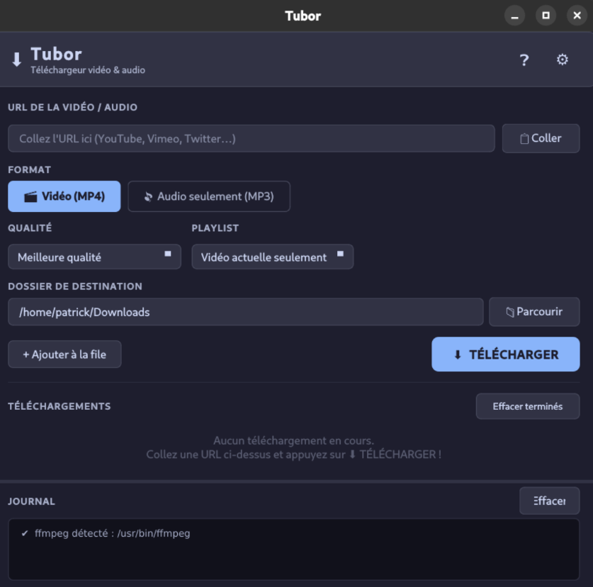

# Tubor 🎬🎵

**Tubor** est une interface graphique Linux pour [yt-dlp](https://github.com/yt-dlp/yt-dlp), le moteur de téléchargement vidéo le plus puissant du moment. Simple par défaut, puissant si besoin.


---

## Fonctionnalités

- **Téléchargement vidéo & audio** — basculez d'un clic entre les modes Vidéo (MP4) et Audio (MP3)
- **Choix de la qualité** — de 360p à 1080p pour la vidéo, 128/192/320 kbps pour l'audio
- **File d'attente** — ajoutez plusieurs URLs et laissez Tubor tout traiter dans l'ordre
- **Progression en temps réel** — vitesse, pourcentage et temps restant par téléchargement
- **Arrêt instantané** — bouton Stop par item ou arrêt global (touche Échap)
- **Détection d'erreurs immédiate** — HTTP 403, vidéo privée, restriction d'âge, etc. stoppent le téléchargement dès la première ligne d'erreur
- **Post-traitement ffmpeg** — fusion des flux, intégration des métadonnées et de la miniature dans le fichier final
- **Support des playlists** — vidéo seule ou playlist complète (avec limite optionnelle)
- **Notifications desktop** — alerte système à la fin de chaque téléchargement
- **Thème sombre / clair** — Catppuccin Mocha & Catppuccin Latte, persistants entre les sessions
- **Configuration persistante** — dossier de téléchargement, format préféré, options sauvegardés dans `~/.config/tubor/config.json`
- **Mise à jour yt-dlp intégrée** — bouton dans les Paramètres pour mettre à jour le moteur sans quitter l'application
- **Support des cookies** — pour les vidéos restreintes par âge ou réservées aux membres

---

## Captures d'écran



---

## Prérequis

| Outil | Version minimale | Notes |
|-------|-----------------|-------|
| Python | 3.10 | |
| PyQt6 | 6.4 | |
| yt-dlp | toute version récente | mis à jour automatiquement via l'app |
| ffmpeg | toute version | optionnel — requis pour la fusion vidéo/audio, les métadonnées et les miniatures |

---

## Installation

### 1. Cloner le dépôt

```bash
git clone https://github.com/nouhailler/tubor.git
cd tubor
```

### 2. Lancer le script d'installation

```bash
chmod +x install.sh
./install.sh
```

Le script installe les dépendances Python, vérifie la présence de ffmpeg et crée un raccourci dans le menu des applications Linux.

### 3. Lancer l'application

```bash
python3 main.py
```

Ou cherchez « Tubor » dans le menu des applications de votre bureau.

---

## Installation manuelle (sans le script)

```bash
pip install --break-system-packages -r requirements.txt
python3 main.py
```

### Installer ffmpeg (recommandé)

```bash
# Ubuntu / Debian
sudo apt install ffmpeg

# Fedora
sudo dnf install ffmpeg

# Arch Linux
sudo pacman -S ffmpeg
```

---

## Utilisation rapide

1. Collez une URL dans le champ en haut (YouTube, Vimeo, Twitch, etc.)
2. Choisissez **🎬 Vidéo** ou **🎵 Audio**
3. Sélectionnez la qualité souhaitée
4. Cliquez sur **⬇ TÉLÉCHARGER** ou **+ Ajouter à la file**
5. Suivez la progression dans le panneau central

Pour de l'aide détaillée, cliquez sur le bouton **❓** dans l'en-tête de l'application.

---

## Structure du projet

```
tubor/
├── main.py                  # Point d'entrée
├── requirements.txt
├── install.sh               # Script d'installation Linux
├── core/
│   ├── config.py            # Persistance de la configuration (JSON)
│   ├── downloader.py        # Moteur subprocess yt-dlp + QThread
│   └── utils.py             # Validation URL, notifications, mise à jour yt-dlp
└── ui/
    ├── main_window.py       # Fenêtre principale
    ├── settings_dialog.py   # Dialogue Paramètres
    ├── download_item.py     # Widget carte par téléchargement
    ├── help_dialog.py       # Documentation intégrée (6 onglets)
    └── styles.py            # Thèmes QSS Catppuccin
```

---

## Détails techniques

### Moteur de téléchargement

Tubor utilise `subprocess.Popen` pour lancer yt-dlp en tant que processus séparé plutôt que l'API Python. Ce choix architectural garantit :

- **Annulation fiable** : `SIGTERM` → `SIGKILL` sans dépendre des hooks internes de yt-dlp
- **Non-blocage de l'UI** : le téléchargement tourne dans un `QThread`, l'interface reste toujours réactive
- **Détection d'erreurs en temps réel** : chaque ligne de sortie est analysée immédiatement ; une erreur 403 stoppe le processus à la première ligne correspondante au lieu d'attendre que tous les fragments aient échoué

### Mise à jour de yt-dlp

yt-dlp évolue très fréquemment (YouTube change régulièrement son code). Le bouton **Mettre à jour yt-dlp** dans les Paramètres exécute `pip install -U yt-dlp` sans redémarrage nécessaire pour les prochains téléchargements.

---

## Roadmap

- [x] Phase 1 — Prototype fonctionnel
- [x] Phase 2 — MVP complet (file d'attente, progression, annulation, erreurs, paramètres)
- [x] Phase 3 — Polish (thèmes, notifications, aide intégrée)
- [ ] Phase 4 — Distribution (AppImage, Flatpak, PyPI)
- [ ] Analyse des formats disponibles avant téléchargement
- [ ] Stockage sécurisé des mots de passe via `keyring`

---

## Contribuer

Les contributions sont les bienvenues ! N'hésitez pas à ouvrir une *issue* ou une *pull request*.

1. Forkez le dépôt
2. Créez une branche (`git checkout -b feature/ma-fonctionnalite`)
3. Commitez vos changements (`git commit -m 'Ajoute ma fonctionnalité'`)
4. Poussez la branche (`git push origin feature/ma-fonctionnalite`)
5. Ouvrez une Pull Request

---

## Licence

Ce projet est distribué sous licence **GPL v3**. Voir le fichier [LICENSE](LICENSE) pour plus de détails.

---

## Remerciements

- [yt-dlp](https://github.com/yt-dlp/yt-dlp) — le moteur qui fait tout le travail
- [ffmpeg](https://ffmpeg.org/) — pour la conversion et le post-traitement
- [Catppuccin](https://catppuccin.com/) — la palette de couleurs utilisée pour les thèmes
